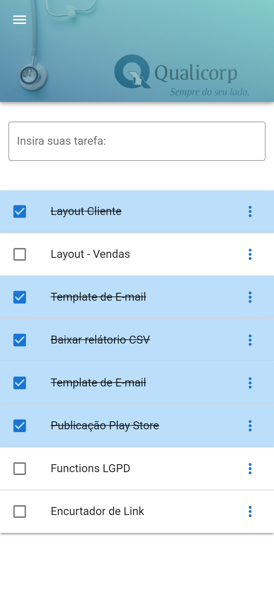
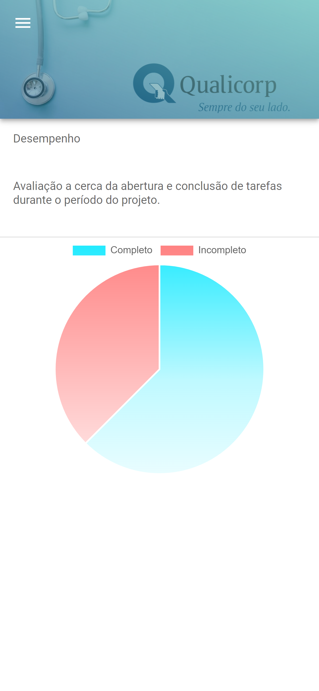
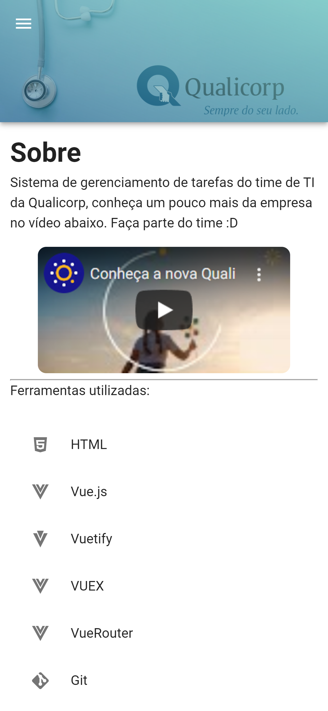

# Qualicorp Front-end challenge

Projeto desenvolvido para o desafio de front-end da qualicorp.

* **Objetivos**
  * Criar um aplicação para lançamento simples de tarefas com as operação de CRUD. 
  
* **Tecnologia**

1. Vue
2. Vuex
3. Vuetify
4. Typescript

* **Como funciona?**

1. yarn install
2. yarn serve

Habilite o navegador como dispotivo modal para aprimorar a experiência.

  * Tela inicial com possibilidade de adição, remoção e atualização de tarefas.

  * Desempenho mediante as tarefas lançadas e finalizadas.

  * Informações adicionais sobre a implementação do projeto.

* **Dificuldades**
  * Não conhecimento prévio do vuetify, foi necessário dedicar algum tempo prévio para
  leitura e estudo da documentação.

* **Desenvolvido por** Jânio Carvalho
